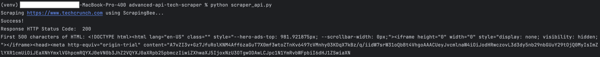

# Advanced Tech News Scraper (API-Based)

A modern Python data collection tool designed to handle JavaScript-heavy websites and bypass sophisticated anti-bot systems using a managed Scraping API.

## Why this exists?
While traditional tools like BeautifulSoup work for static sites, modern platforms (like Yahoo Finance or LinkedIn) require:
* **JavaScript Rendering:** To load dynamic content.
* **IP Rotation:** To avoid rate-limiting.
* **CAPTCHA Solving:** To ensure uninterrupted collection.

This project demonstrates how to integrate professional-grade scraping APIs into a Python workflow.

## Technical Stack
* **Language:** Python 3.14
* **Library:** `requests` for API communication
* **Environment:** `python-dotenv` for secure credential management
* **Infrastructure:** ScrapingBee or ZenRows

## Setup Instructions

### 1. Clone Repository & Setup Your Environment
```bash
git clone [https://github.com/RootedDreamsBlog/advanced-api-tech-scraper.git](https://github.com/RootedDreamsBlog/advanced-api-tech-scraper.git)
cd advanced-api-tech-scraper
```

#### Create a Virtual Environment
##### MacOS/Linux
```bash
python3 -m venv venv
```

##### Windows
```bash
python -m venv venv
```

#### Activate the virtual environment
##### MacOS/Linux
``` bash
source venv/bin/activate
```

##### Windows
```bash
.\venv\Scripts\activate
```

#### Install Dependencies
```bash
pip install -r requirements.txt
```

### 2. Configuration
Create a .env file in the root directory and add the following entry:

**SCRAPING_API_KEY=your_key_here**

### 3. Run the Scraper
```bash
python scraper_api.py
```

## Security Note
This project uses .env files to keep API credentials secure. The .env file is included in .gitignore to prevent sensitive data from being pushed to public version control.

## Preview
### Terminal Output


## Contact
Built by **RootedDreamsBlog** (https://www.rooteddreams.net) or read the full article on **web scraping API Python** at https://www.rooteddreams.net/web-scraping-api-python/

Disclaimer: This project is for educational purposes and respects the robots.txt guidelines of the target website.

